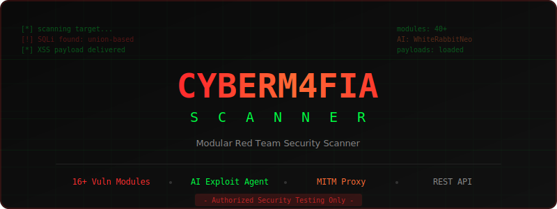

<p align="center">
  
</p>

<p align="center">
  <strong>Modular red team security scanner for web applications, APIs, networks, and cloud infrastructure.</strong>
</p>

<p align="center">
  <a href="https://github.com/erkanrzgc/cyberm4fia-scanner/blob/main/LICENSE"></a>
  
  
  
  
  
</p>

<p align="center">
  <a href="#quick-start">Quick Start</a> &bull;
  <a href="#features">Features</a> &bull;
  <a href="#usage-with-ai">AI Integration</a> &bull;
  <a href="#rest-api">REST API</a> &bull;
  <a href="#configuration">Configuration</a>
</p>

---

> [!WARNING]
> **Authorized security testing only.** Unauthorized scanning of systems you do not own or have permission to test is illegal. The developers assume no liability for misuse.

## Quick Start

```bash
git clone https://github.com/erkanrzgc/cyberm4fia-scanner.git
cd cyberm4fia-scanner
pip install -r requirements.txt
```

Launch the interactive setup wizard:

```bash
python3 scanner.py
```

Or use the CLI directly:

```bash
# Full scan
python3 scanner.py -u https://target.com --all

# Specific modules
python3 scanner.py -u https://target.com --xss --sqli

# API scan with OpenAPI spec
python3 scanner.py -u https://api.target.com --api-scan --api-spec openapi.yaml

# Multi-target
python3 scanner.py -l targets.txt --all

# Through proxy
python3 scanner.py -u https://target.com --all --proxy socks5://127.0.0.1:9050

# Session resume
python3 scanner.py --resume scan1.json
```

## Features

<details>
<summary><strong>Web Application Scanning</strong> — 16 modules</summary>

<!-- BEGIN GENERATED: feature_tables -->
| Module | Flag | Description |
|---|---|---|
| XSS | `--xss` | Reflected and stored XSS checks with context-aware payload selection. |
| SQLi | `--sqli` | Union-based SQL injection with blind fallback and exploit post-processing. |
| LFI | `--lfi` | Local File Inclusion checks against traversal and wrapper payloads. |
| RFI | `--rfi` | Remote File Inclusion checks for remote fetch and execution sinks. |
| CMDi | `--cmdi` | OS command injection checks with optional interactive shell workflow. |
| SSRF | `--ssrf` | Server-Side Request Forgery checks including cloud metadata probes. |
| CSRF | `--csrf` | CSRF token and form protection checks for discovered forms. |
| CORS | `--cors` | Cross-Origin Resource Sharing misconfiguration checks. |
| Header Injection | `--header-inject` | CRLF and header injection checks. |
| DOM XSS | `--dom-xss` | DOM-based XSS checks with Playwright browser execution. |
| SSTI | `--ssti` | Template injection checks for common server-side template engines. |
| XXE | `--xxe` | XML External Entity injection checks. |
| Open Redirect | `--redirect` | Redirect abuse checks across discovered URLs. |
| Passive Scan | `--passive` | Passive checks for headers, debug leakage, and lightweight disclosures. |
| Secrets Scan | `--secrets` | HTML and JavaScript secret exposure scanning for API keys and tokens. |
| OOB Testing | `--oob` | Out-of-band callback support for blind vulnerability verification. |

</details>

<details>
<summary><strong>API Security</strong></summary>

| Module | Flag | Description |
|---|---|---|
| API Scanner | `--api-scan` | OWASP API tests with OpenAPI import, schema-aware bodies, and auth intel. |

</details>

<details>
<summary><strong>Network & Infrastructure</strong> — 8 modules</summary>

| Module | Flag | Description |
|---|---|---|
| Recon | `--recon` | Deep port, DNS, and TLS recon. Lightweight server and header intel runs on every scan. |
| Subdomain Discovery | `--subdomain` | Subdomain enumeration for the target host. |
| Endpoint Fuzzer | `--fuzz` | Directory and API endpoint brute forcing with smart 404 calibration. |
| Crawler | `--crawl` | Recursive crawler with form and link discovery. |
| Headless Discovery | `--headless` | Playwright-based SPA rendering and background endpoint discovery. |
| Cloud Buckets | `--cloud` | Open S3, Azure Blob, and GCP bucket detection. |
| Subdomain Takeover | `--takeover` | Dangling DNS and takeover fingerprint checks. |
| Credential Spray | `--spray` | Default credential checks for exposed services. |

</details>

<details>
<summary><strong>Intelligence & OSINT</strong></summary>

| Module | Flag | Description |
|---|---|---|
| Technology Fingerprinting | `--tech` | Wappalyzer-style technology detection with CVE enrichment. |
| OSINT Enrichment | `--osint` | Shodan InternetDB, WHOIS, and ASN enrichment. |
| Email Harvesting | `--email` | Email discovery from public sources and on-page content. |

</details>

<details>
<summary><strong>Automation & Reporting</strong> — 12 modules</summary>

| Module | Flag | Description |
|---|---|---|
| JWT Attack Suite | `--jwt` | Weak secret, algorithm confusion, and claim tampering checks. |
| Race Condition | `--race` | TOCTOU and replay-style concurrency checks. |
| HTTP Smuggling | `--smuggle` | CL.TE and TE.CL request smuggling checks. |
| Prototype Pollution | `--proto` | Node.js prototype pollution probes. |
| Deserialization | `--deser` | Insecure deserialization checks. |
| Business Logic | `--bizlogic` | Multi-step business logic flaw checks. |
| Vulnerability Chaining | `--chain` | Attack path correlation across discovered findings. |
| Wordlist Generation | `--wordlist` | Site-specific password wordlist generation. |
| AI Analysis | `--ai` | Dual-model AI with autonomous exploit agent, PoC generation, and false-positive filtering. |
| Proxy Interceptor | `--proxy-listen PORT` | Built-in MITM proxy to capture traffic and feed scanner workflows. |
| PoC Generator | `(auto)` | Automatic HTML and JSON proof-of-concept generation for findings. |
| Template Engine | `(auto via --all)` | Built-in template-based checks that can be enabled through all-modules mode. |
<!-- END GENERATED: feature_tables -->

</details>

---

## Active Exploitation Framework

cyberm4fia-scanner goes beyond finding vulnerabilities — it verifies and exploits them. Pass the `--exploit` flag to activate post-exploitation modules:

- **Interactive Shells** — Catch reverse shells automatically when CMDi or RCE is discovered
- **Out-of-Band (OOB) Testing** — Spin up local HTTP listeners for blind/async vulnerability detection
- **Automated Looting** — Extract database contents (SQLi) or grab sensitive files (LFI) into `loot/`
- **PoC Generation** — Standalone `.html` or `.json` artifacts demonstrating exact vulnerabilities
- **Auto-Pwn Hand-off** — Ready-to-run Nuclei templates or Metasploit commands
- **Headless Browser Escalation** — Playwright-driven DOM XSS and CSRF payload execution

---

## Built-in Proxy Interceptor

Route manual browser traffic through the scanner's built-in MITM proxy:

```bash
python3 scanner.py --proxy-listen 8081 --scope-proxy target.com
```

Traffic is automatically intercepted, fed into the scanning engine, and tested for vulnerabilities in real-time.

---

## Usage with AI

The scanner integrates a **dual-model AI system** for autonomous exploit generation, intelligent analysis, and automated PoC creation.

### Prerequisites

Install [Ollama](https://ollama.com/) and pull the required models:

```bash
ollama pull WhiteRabbitNeo/Llama-3.1-WhiteRabbitNeo-2-8B
ollama pull qwen3-coder:30b
```

If Ollama runs on a different machine:

```bash
export OLLAMA_URL="http://127.0.0.1:11434"
```

### AI-Powered Scanning

```bash
python3 scanner.py -u https://target.com --all --ai
python3 scanner.py -u https://target.com --xss --sqli --ai
python3 scanner.py -u https://target.com --all --ai --mode stealth
```

### Dual-Model Architecture

| Model | Role | What It Does |
|---|---|---|
| **WhiteRabbitNeo 8B** | Exploit & Strategy | Payload crafting, WAF bypass, exploit planning, false-positive filtering |
| **Qwen3-Coder 30B** | Code Generation | PoC script writing, remediation code, code analysis |

The system automatically routes tasks to the best model. If one model is unavailable, it falls back to the other.

### AI Exploit Agent

When standard payload lists fail, the **Autonomous AI Exploit Agent** takes over:

```
Static Payloads --> Smart Probes --> WAF Mutation --> AI Exploit Agent
                                                           |
                                                  Think --> Generate --> Execute
                                                  --> Validate --> Learn (3 rounds)
                                                           |
                                                  PoC: cURL + Python + Nuclei
```

**Supported vulnerability types:** XSS, SQLi, LFI, CMDi, SSRF

**Anti-hallucination pipeline:** Every AI-generated exploit is validated with regex checks + AI double-verification. Confidence below 70% is automatically rejected.

<details>
<summary><strong>Public Exploit Intelligence</strong></summary>

The scanner automatically searches for known public exploits when CVEs are discovered:

```
Technology Detected --> SiberAdar CVE Feed --> Public Exploit Search
                                                      |
                                        ExploitDB (searchsploit)
                                        GitHub PoC repositories
                                        sploitscan aggregation
                                                      |
                                        AI Agent uses real PoCs as templates
```

Optional tools for enhanced coverage:

```bash
sudo apt install exploitdb      # ExploitDB offline archive
pip3 install sploitscan          # Multi-source exploit search
```

</details>

<details>
<summary><strong>AI Features Summary</strong></summary>

| Feature | Description |
|---|---|
| **Autonomous Exploit Agent** | Iterative think > generate > execute > validate > learn loop |
| **Dual-Model Routing** | WhiteRabbitNeo for exploits, Qwen3-Coder for code |
| **Anti-Hallucination** | Regex + AI verification, 70% confidence threshold |
| **PoC Generation** | Auto-generates cURL, Python scripts, Nuclei templates |
| **Exploit Chain Detection** | 7 built-in patterns + AI-discovered chains |
| **Public Exploit Search** | ExploitDB, GitHub, sploitscan integration |
| **WAF Bypass Mutation** | Evolving AI mutation engine for adaptive bypass |
| **False Positive Filtering** | AI-assisted validation reduces noise |
| **Remediation Guidance** | AI-generated code fixes and best practices |
| **Executive Summaries** | AI-written C-level security reports |

</details>

---

## Scan Modes

<!-- BEGIN GENERATED: scan_modes -->
| Mode | Delay | Threads | Use Case |
|---|---|---|---|
| `normal` | 0.5s | 10 | Balanced default mode for most targets. |
| `stealth` | 3.0s | 1 | Slow, low-noise mode for cautious testing. |
| `lab` | 0.05s | 30 | High-noise mode for local labs, staging, and CTF environments only. |
<!-- END GENERATED: scan_modes -->

## Attack Profiles

<details>
<summary><strong>View all profiles</strong></summary>

<!-- BEGIN GENERATED: attack_profiles -->
| Profile | Coverage | Included Flags | Suggested Extras |
|---|---|---|---|
| `1-Fast Recon` | Recon, subdomain discovery, endpoint fuzzing, technology intel, and passive checks. | `--fuzz`, `--passive`, `--recon`, `--subdomain`, `--tech` | `--crawl`, `--osint`, `--headless` |
| `2-Core Web Vulns` | Core web checks like XSS, SQLi, file inclusion, CMDi, CSRF, CORS, and DOM XSS. | `--cmdi`, `--cors`, `--csrf`, `--dom-xss`, `--header-inject`, `--lfi`, `--passive`, `--rfi`, `--sqli`, `--xss` | `--secrets`, `--oob`, `--headless`, `--exploit` |
| `3-Advanced / Modern` | JWT, deserialization, SSTI, race, prototype pollution, SSRF, business logic, API, OOB, and XXE coverage. | `--api-scan`, `--ato`, `--auth-bypass`, `--bizlogic`, `--deser`, `--file-upload`, `--forbidden-bypass`, `--jwt`, `--oob`, `--proto`, `--race`, `--redirect`, `--smuggle`, `--ssrf`, `--ssti`, `--xxe` | `--tech`, `--passive`, `--chain`, `--exploit` |
| `4-All-In-One` | Enables nearly every scan module except opt-in extras like AI and SARIF. | `(auto via --all)` + all modules | `--wordlist`, `--exploit` |
| `5-Custom Choice` | Ask every module prompt one by one. | `manual selection` | - |
<!-- END GENERATED: attack_profiles -->

</details>

---

## REST API

The scanner includes a FastAPI-based REST API with auto-generated documentation.

```bash
python3 scanner.py --api --port 8080
```

| Endpoint | Method | Description |
|---|---|---|
| `/api/scan` | POST | Start a new scan |
| `/api/scan/{id}` | GET | Get scan results |
| `/api/scans` | GET | List all scans |
| `/api/report/{id}` | GET | Download HTML report |
| `/api/scan/{id}` | DELETE | Cancel a scan |
| `/docs` | GET | Swagger UI |
| `/redoc` | GET | ReDoc |

---

## Project Structure

```
cyberm4fia-scanner/
├── scanner.py              # main orchestrator
├── api_server.py           # FastAPI REST API
├── modules/                # 40+ scanning modules
├── utils/                  # HTTP client, WAF detection, auth, AI engine
│   ├── ai.py               # dual-model AI client (WhiteRabbitNeo + Qwen3-Coder)
│   ├── ai_exploit_agent.py # autonomous exploit agent + chain detector
│   └── exploit_finder.py   # ExploitDB, GitHub PoC, sploitscan search
├── payloads/               # XSS, SQLi, LFI, SSRF, CMDi payload files
├── wordlists/              # fuzzer wordlists
├── tests/                  # pytest test suite (247 tests)
├── .github/workflows/      # CI/CD pipelines
├── .env.example            # environment variable template
└── requirements.txt        # dependencies
```

## Configuration

Copy `.env.example` to `.env` and set your values:

```bash
cp .env.example .env
```

| Variable | Description |
|---|---|
| `OLLAMA_URL` | Ollama API URL (default: `http://127.0.0.1:11434`) |
| `WATCHSTACK_API_KEY` | WatchStack.io API key for verified PoC intelligence (free tier: 30 req/min) |
| `GITHUB_TOKEN` | GitHub API token for higher rate limits on PoC search |
| `SHODAN_API_KEY` | Shodan API key for OSINT enrichment |
| `DEFAULT_THREADS` | Default thread count |
| `DEFAULT_DELAY` | Default request delay |
| `VERIFY_SSL` | SSL verification toggle |
| `HTTP_PROXY` | Proxy URL |

## Testing

```bash
pip install pytest
pytest tests/ -v
```

## License

This project is licensed under the [MIT License](LICENSE).
